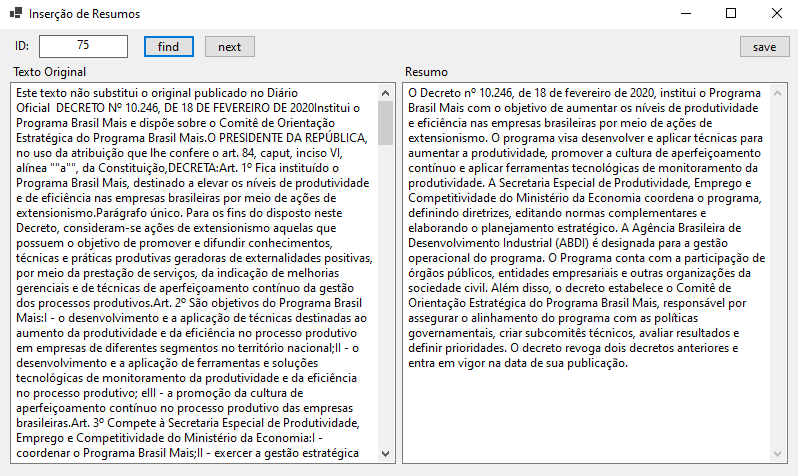

# PublicPolicySummarizer

Neste repositório você encontrará dados e códigos relacionados a um projeto sumarização de decretos de políticas públicas.

## Organização do repositório

- `politicas-base.csv`: Arquivo baixado em [catalogo ipea](https://catalogo.ipea.gov.br/consulta) em 12/05/2024.

- [`nb.ipynb`](nb.ipynb): Notebook jupyter com blocos de código Python utilizados para baixar e preparar os dados iniciais. Neste notebook está o processo e os critérios utilizados para preparar os textos de entrada.

- `dados_politicas.csv`: Arquivo gerado por um block do `nb` ao acessar os links indicados no catalogo. O campo `texto` deste arquivo contém textos das respectivas páginas, isto incluído todo texto da página, incluso botões, links, labels, etc.

- `textos_politicas.csv`: Arquivo gerado por processar o arquivo `dados_politicas.csv` removendo textos adicionas advindos das páginas web.

- `resumos_politicas.csv`: Arquivo gerado com auxilido da ferramenta `InsertSummary` e chatGPT.

## InsertSummary

No diretório `InsertSummary` temos uma interface Windows Forms que pode ser utilizada para acessar os textos do arquivo `textos_politicas.csv` e inserir resumos no arquivo `resumos_politicas.csv`.

Esta interface foi desenvolvida para facilitar e evitar erros no processo de geração de uma base de resumos utilizando o [chatGPT](https://chatgpt.com/) da OpenAI.

## Dependências

- Python: 3.12.1
- Bibliotecas Python:
    - pandas
    - requests
    - bs4
- Executamos os blocos python com [VS Code](https://code.visualstudio.com/)
- O programa [`InsertSummary`](./InsertSummary/README.md) foi elaborado com [Visual Studio 2022](https://visualstudio.microsoft.com/pt-br/vs/)
    - Microsoft .NET 8.0

